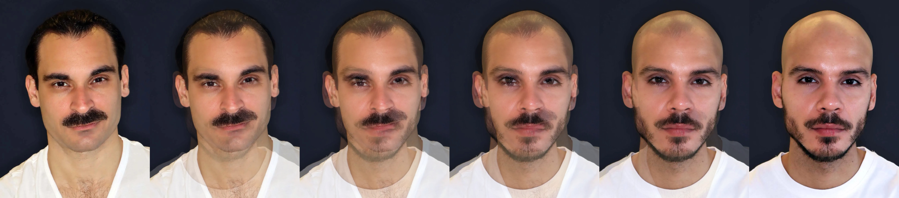
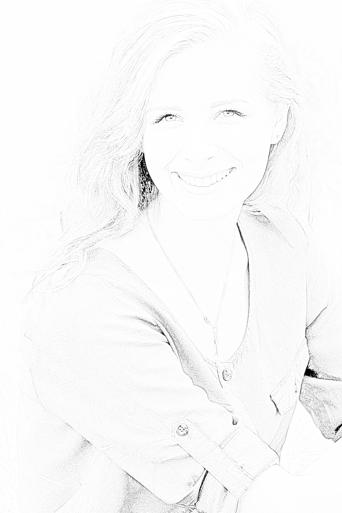
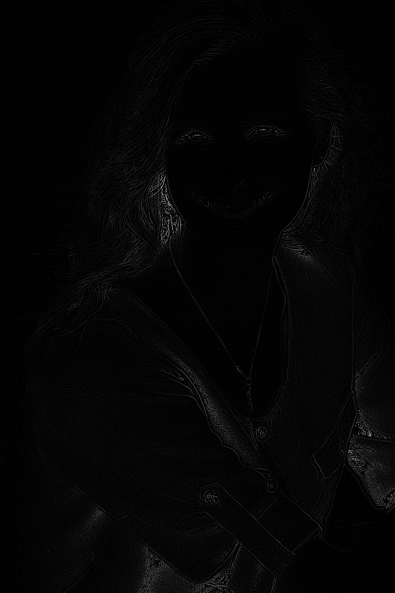
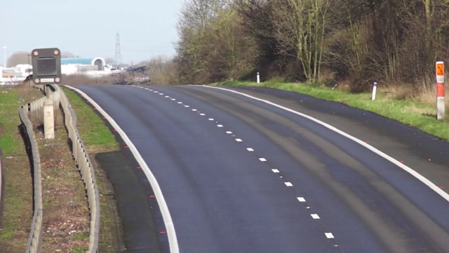
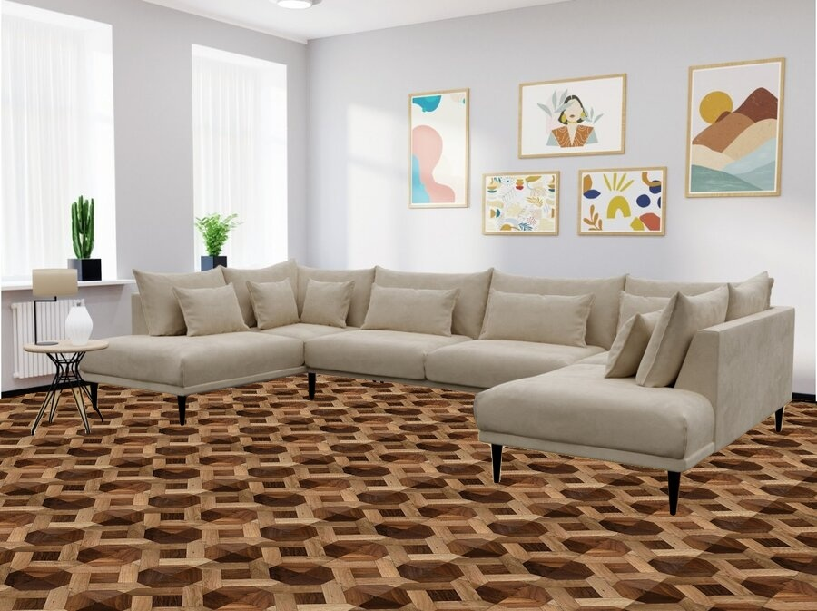

# Session 29

This Folder contains various projects showcasing basic math operations and image processing techniques using OpenCV and NumPy. Each project is designed to demonstrate specific skills and provide practical applications of image processing concepts.

## Assignments

1. **Assignment _1: Face Morphing**
   - Morphing one face into another using OpenCV. The output includes 5 images showing the transition from one face to another.

     

2. **Assignment _2: Black Hole**
   - Using image processing (denoising and concatinating) and numpy to contribute to the **FIRST IMAGE OF A BLACK HOLE**.

     

3. **Assignment _3: Photo to Sketch**
   - Converting a photo into a sketch using image processing techniques.

     
     

4. **Assignment _4: Find the Secret Text**
   - Revealing hidden text within an image using image processing and numpy.

     

5. **Assignment _5: Background Estimation**
   - Calculating the average of video frames to create an image of an empty road without cars.

     

6. **Assignment _6: Virtual Decoration**
   - Using a mask to apply a new floor in a room using image processing techniques.

     

     

## How to Run the Code
1. Clone the repository:
   ```sh
   git clone https://github.com/nakhani/Image-Processing/tree/7a9f40ca811164d08bcc370afc3ba122be1b8c43/Basic%20Math%20Operations
   ```

2. Navigate to the directory:
   ```sh
   cd Basic Math Operations
   ```

3. Install the required packages:
   ```sh
   pip install -r requirements.txt
   ```

4. Run the assignments:
   ```sh
   python Assignment_1.py  # For creating morphing face
   python Assignment_2.py  # For denoising and concatinating black hole images
   python Assignment_3.py  # For generating a sketched photo
   python Assignment_4.py  # For finding the secret text
   python Assignment_5.py  # For generating background image
   python Assignment_6.py  # For generating Virtual decoration
   
   ```

## Technologies Used
- Python 3
- OpenCV
- NumPy
