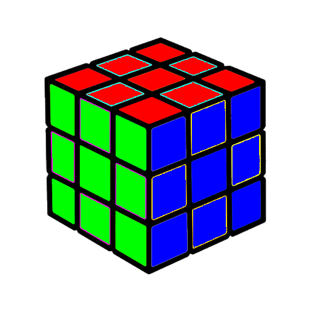

# Color image processing

 This repository showcases basic color image processing techniques using RGB channels with cv2 and numpy, providing examples and code snippets to manipulate and analyze images.


### 1. Converting a color image to a grayscale image

  Writing a function to convert a color image to a grayscale image.

  #### Input:
  
   

  #### Output:

   

### 2. Rainbow
  
  Drawing a beautiful rainbow.

  The output:

   

   


### 3. Materwelon

  Converting Watermelon 🍉 to Materwelon. 

   #### Input:
  
   

  #### Output:

   
   
  


### 4. Rubik's cube
  
  Solving the rubik's cube.

  #### Input:
  
   

  #### Output:

   

### 5.  Microsoft logo
  
  Designing Microsoft logo.

  #### Output:

   


## How to Run the Code
1. Clone the repository:
   ```sh
   git https://github.com/nakhani/Image-Processing/tree/a83f3d9d52d1eb87c283d1a9d79046e14f3ee8b1/Color%20image%20processing

2. Navigate to the directory:
   ```sh
   cd Color image processing
   ```

3. Install the required packages :
   ```sh
   pip install -r requirements.txt
   ```

4. Run the assignments:
   ```sh
    python rainbow.py  # For drawing a beautiful rainbow
    python watermelon.py  # For converting Watermelon to Materwelon
    python rubik_cube.py  # For solving the rubik's cube 
    python microsoft.py # For designing Microsoft logo
   ```
   ```sh
    jupyter notebook color_to_gray.ipynb # For converting a color image to a grayscale image
   ```

## Technologies Used
- Python 3
- OpenCV
- NumPy
- Matplotlib
