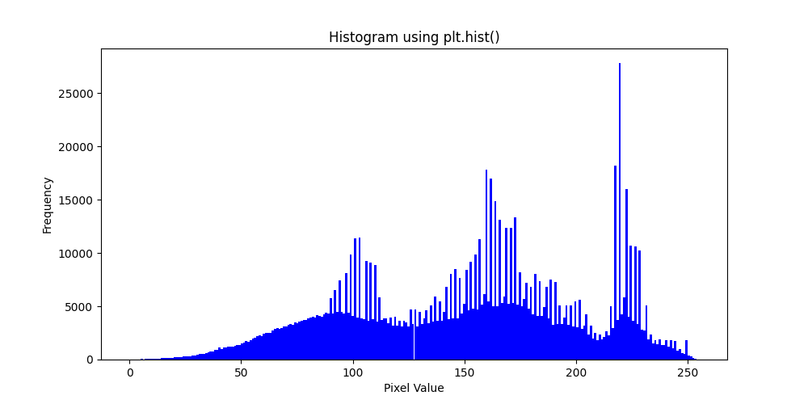
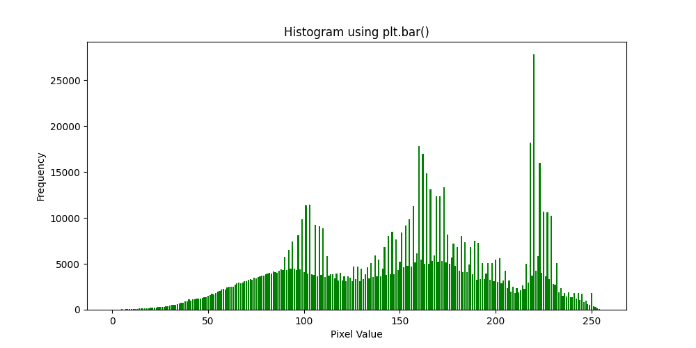
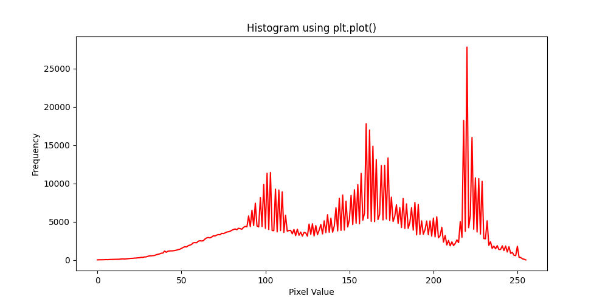

# Convolution and Histogram

 Our primary focus is on convolution and histogram calculations, avoiding the use of OpenCV built-in functions for filtering and histogram computations.


### 1. Histogram 
  Writing a function that takes an image as an input argument, computes the histogram, and returns it.visualizing the results using `plt.plot()`, `plt.hist()`, and `plt.bar()`.
  
  
  
  

### 2. Foreground Focus, Blur Background 
  A blurred background draws the focus to what’s important, differentiating between a professional portrait and a casual snapshot.

  
  


### 3. Edge Detection
  Using the Laplacian operator to detect edges in an image.

  #### Kernel:
   ```bash
     kernel = np.array([[-1, -1, -1],
                   [-1,  8, -1],
                   [-1, -1, -1]])
   ```

  
  


### 4. Vertical and Horizontal Edge Detection
  Using suitable kernels to detect vertical and horizontal edges.

  #### Vertical Kernel:
   ```bash
     kernel_vertical = np.array([[-1, 0, 1],
                            [-2, 0, 2],
                            [-1, 0, 1]])
   ```

  #### Horizontal Kernel:
   ```bash
     kernel_horizontal = np.array([[ 1,  2,  1],
                              [ 0,  0,  0],
                              [-1, -2, -1]])
   ```


  
  
### 5. Noise Reduction 
  Mean filtering reduces noise by replacing each pixel value with the average value of its neighbors, using a 3x3, 5x5, or larger kernel for more severe smoothing.

  
  
  


## How to Run the Code
1. Clone the repository:
   ```sh
   git https://github.com/nakhani/Image-Processing/tree/286dbe09b8654bfae8a1a382568e0fb1eaa8bc76/Convolution%20and%20Histogram

2. Navigate to the directory:
   ```sh
   cd Convolution and Histogram
   ```

3. Install the required packages in each folder:
   ```sh
   pip install -r requirements.txt
   ```

4. Run the assignments:
   ```sh
   python histogram.py  # For generating a histogram
   python change_background.py  # For blurring background and focusing on foreground
   python edge_detection.py  # For detecting edge
   python edge_detection2.py  # For detecting vertical and horizontal edge 
   python noise_reduction.py  # For reducing noise with different kernel (3*3, 5*5, 15*15)
   ```

## Technologies Used
- Python 3
- OpenCV
- NumPy
- Matplotlib
