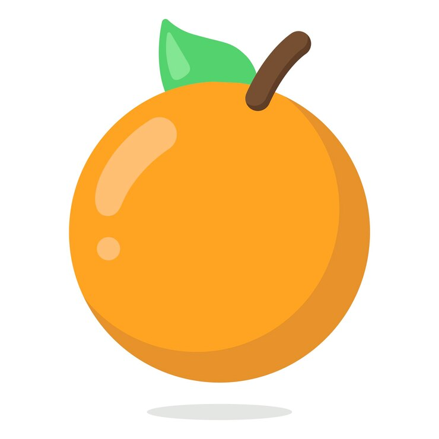
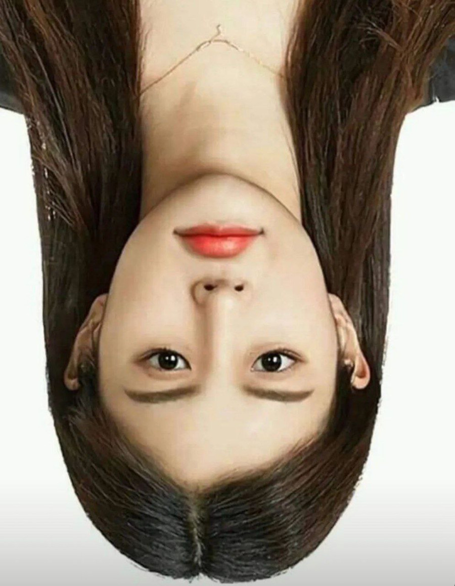
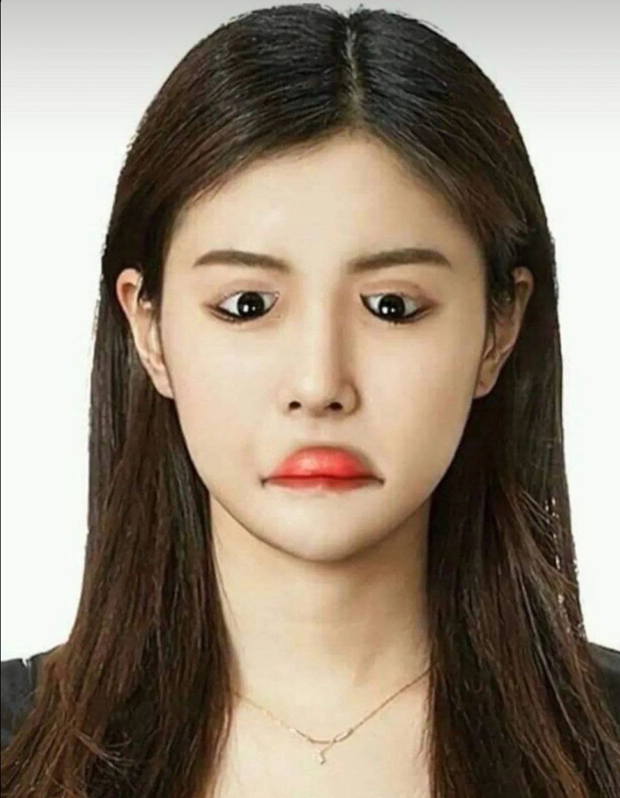
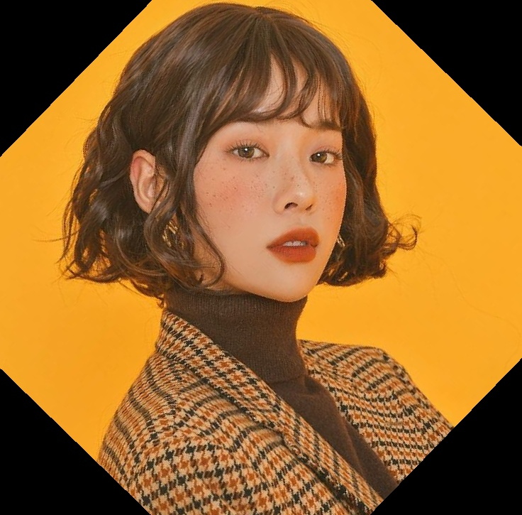
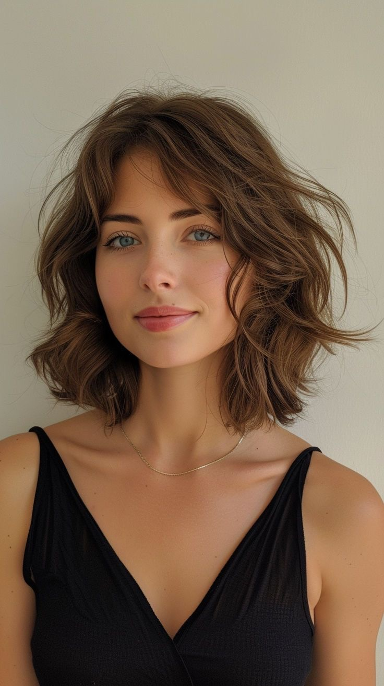
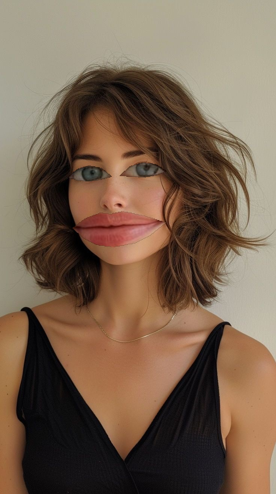

# Session 30

This Folder contains various projects showcasing face alignments and image processing techniques using OpenCV and NumPy. Each project is designed to demonstrate specific part of face alignments and provide practical applications of image processing concepts.

## Assignments

1. **Assignment _1: Fruit And Vegetable Snapchat Filter**
   - Putting one face onto fruit images. The output includes fruit images with the eyes and lips person.

     
     

2. **Assignment _2: Rotating**
   - Using OpenCV to rotate images in desire angle.

     
     


3. **Assignment _3: Align Face**
   - Rotating images through detecting and aligning their eyes's angle.

     
     

4. **Assignment _4: Big eyes and lips filter**
   - Zooming person's eyes and lips.
     
     
     


     

## How to Run the Code
1. Clone the repository:
   ```sh
   git clone https://github.com/nakhani/Image-Processing/tree/9e91016e4b5ae22281cf66442731286cbcd0cb7a/Face%20Alignment
   ```

2. Navigate to the directory:
   ```sh
   cd Face Alignment
   ```

3. Install the required packages which exist in each folder:
   ```sh
   pip install -r requirements.txt
   ```

4. Run the assignments:
   ```sh
   python fruit_filter.py  # For creating Fruit And Vegetable Snapchat Filter
   python rotated_image.py  # For Rotating images
   python main.py  # For creating Big eyes and lips filter
   
   
   ```

## Technologies Used
- Python 3
- OpenCV
- NumPy
- Tensorflow
