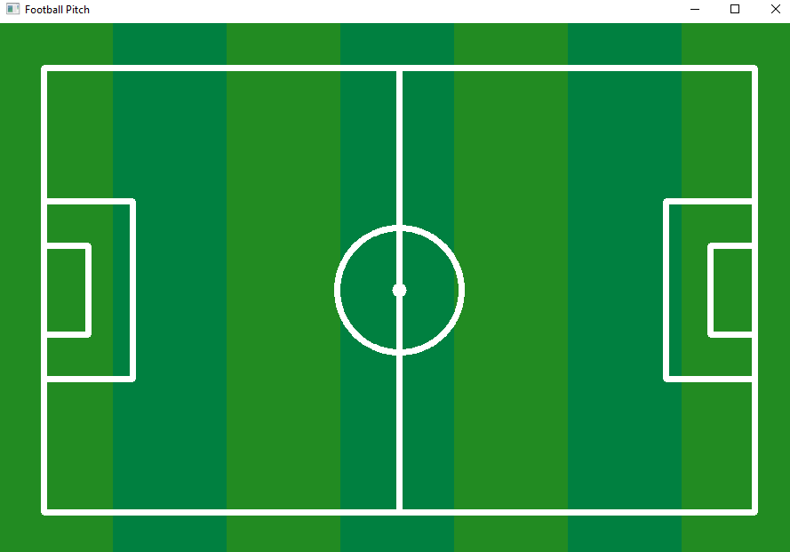

# Session 28 

Welcome to the Face Detection and Fun Filters project! This repository contains various programs for face detection and applying fun filters on faces. 

## Features

1. **Draw a Football Pitch**
   - Create a visual representation of a football pitch.

     

2. **Count the Number of Cats in an Image**
   - Write a program to read an image and count the number of cats in it.

     

3. **Webcam Filters**
   - Apply various fun filters on your face using your webcam.

     **Features** :

      - **Press 1️⃣ on keyboard:**
         - Apply a non-square sticker on your face.

     - **Press 2️⃣ on keyboard:**
         - Apply sunglass and lipstick stickers on your eyes and lips 

     - **Press 3️⃣ on keyboard:**
         - Apply a chess-board face filter.

     - **Press 4️⃣ on keyboard:**
         - Apply a mirror filter.

## How to Run the Code
1. Clone the repository:
   ```sh
   git clone https://github.com/nakhani/Image-Processing/tree/1b42df42485fd7b7ca4e32dc48c2ed0a0930c99d/Digital%20Image%20Processing_2
   ```

2. Navigate to the directory:
   ```sh
   cd Face Detection
   ```

3. Install the required packages:
   ```sh
   pip install -r requirements.txt
   ```

4. Run the assignments:
   ```sh
   python cat.py  # For counting the cat's number
   python face_filters.py  # For applying filters on your face through webcam
   python football.py  # For drawing a football pitch
   
   ```

## Technologies Used
- Python 3
- OpenCV
