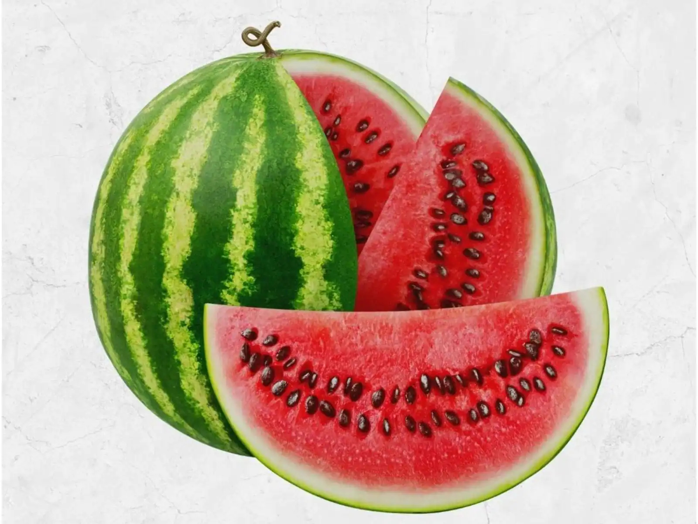
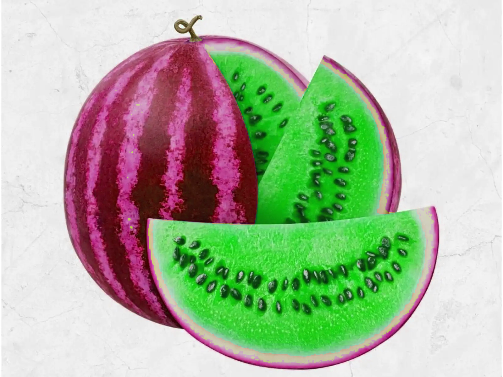
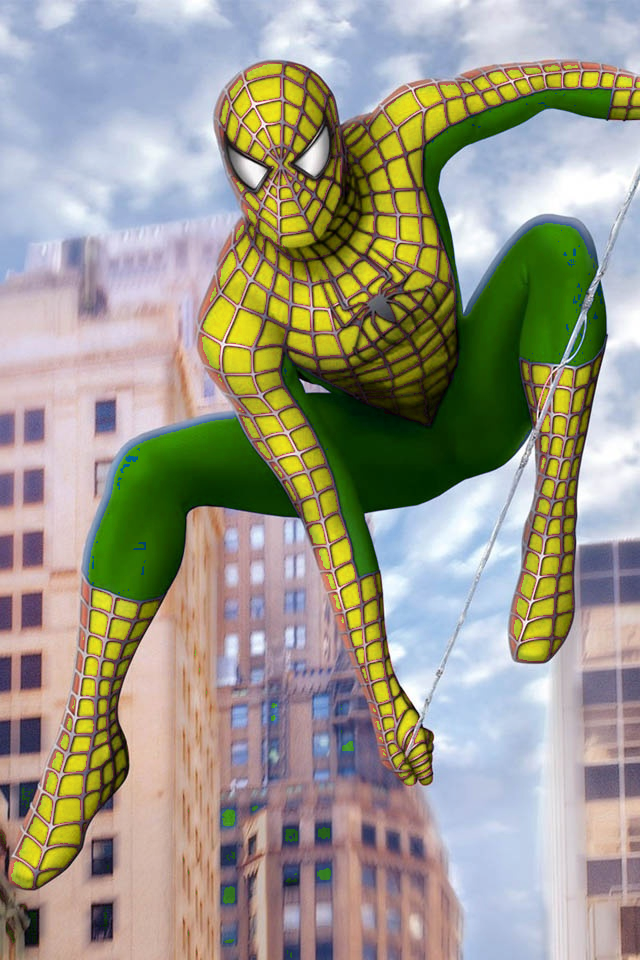

# HSV color space

This repository provides a comprehensive guide and example code for working with the HSV (Hue, Saturation, Value) color space using Python and OpenCV. It includes various techniques for color detection, segmentation, and manipulation, making it ideal for projects involving image processing and computer vision. You will find detailed explanations and code snippets to help you understand and implement the HSV color space in your applications.

### 1. Watermelon to Materwelon convertor

  Watermelon to Materwelon convertor using HSV color space.

  #### Input:
  
   

  #### Output:

   

### 2. Color Recognition
  
  Color Recognition with webcam using HSV color space.

### 3. Balloons Detection

  Balloons Recognition using HSV color space.

   #### Input:
  
   

  #### Output:

   
   
### 4. Skin Detection
  
  Skin detection with webcam using HSV color space.


### 5.  Blue Screen Technique
  
  The term “blue screen” is used to describe a film technique in which the background of a scene is filmed in front of what looks like a blue or green screen, then replaced by computer-generated imagery. The result is that actors can be inserted convincingly into scenes with backgrounds that are not otherwise possible.
  Changing the background of the image below. Fly Superman in the sky.

  #### Input:
  
   

  #### Output:

   

### 6.  Change the clothes color
  
   Changing the clothes color in a portrait photo of yourself. 

  #### Input:
  
   

  #### Output:

   

### 7.  Spiderman's clothes
  
  Changing Spiderman's clothes to green and yellow. 

  #### Input:
  
   

  #### Output:

   


## How to Run the Code
1. Clone the repository:
   ```sh
   https://github.com/nakhani/Image-Processing/tree/e3e6af43f19625a249cfa700cf94ac0d94853c11/HSV%20color%20space
   ```

2. Navigate to the directory:
   ```sh
   cd HSV color space
   ```

3. Install the required packages in each folder :
   ```sh
   pip install -r requirements.txt
   ```

4. Run the assignments:
   ```sh
    python balloons_detection.py  # For detecting balloons
    python bluescreen_detection.py  # For changing spiderman's background
    python detector.py  # For detecting color using webcam
    python skindetector.py # For detecting skin using webcam
   ```
   
   ```sh
    jupyter notebook clothe.ipynb # For changing the color of clothes
    jupyter notebook melon.ipynb # For converting watermelon to materwelon
    jupyter notebook spiderman.ipynb # For changing the spiderman's clothe
   ```

## Technologies Used
- Python 3
- OpenCV
- NumPy
- Matplotlib
