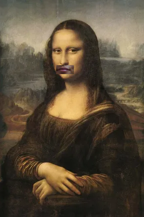

# Object Detection

This repository contains various assignments and projects related to object detection, image processing, and computer vision. The projects demonstrate practical applications of **contour detection**, **histogram manipulation**, and **color recognition**, as well as implementing common OpenCV functions from scratch. Below are the key topics covered in this repository:

### 1. Histogram to Image

  Writing a function to reconstruct an image from a given histogram.

  #### Output:

   

  

### 2. Dice Recognition
  
A notebook to count the number of dots on dice using image processing techniques.

  #### Output:

   |   |    |    |    |
 |------------|------------|------------|------------|
 | 5,5,5,5,5| 1,6,3| 5,1| 3|


   

### 3. Implement Common OpenCV Functions from Scratch

   - #### cv2.boundingRect():

     Implement the `cv2.boundingRect(contour)` function from scratch.

   - #### cv2.contourArea():
   
      Implement the `cv2.contourArea(contours)` function from scratch.

   - #### cv2.findContours():
   
      Implement the `cv2.findContours(image, cv.RETR_EXTERNAL, cv.CHAIN_APPROX_NONE)` function from scratch.


### 4. A Funny Webcam Application
  
 Creating  a fun and engaging webcam application.
   #### Output:

   


## How to Run the Code
1. Clone the repository:
   ```sh
   git https://github.com/nakhani/Image-Processing/tree/af1d980b0aa63de01a0f028f38d8dc87f92cd046/Object%20Detection

2. Navigate to the directory:
   ```sh
   cd Object Detection
   ```

3. Install the required packages in each folder:
   ```sh
   pip install -r requirements.txt
   ```

4. Run the assignments:
   ```sh
    python boundingrec.py  # For implementing function boundingrec from scratch
    python contourarea.py  # For implementing function contourarea from scratch
    python findcontours.py  # For implementing function findcontours from scratch
    python webcam.py # For creating funny filter application
   ```
   ```sh
    jupyter notebook histogramto_image.ipynb # For reconstructing an image from histogram
    jupyter notebook dice_recognition.ipynb # For counting dots in each dice
   ```

## Technologies Used
- Python 3
- OpenCV
- NumPy
- Matplotlib
