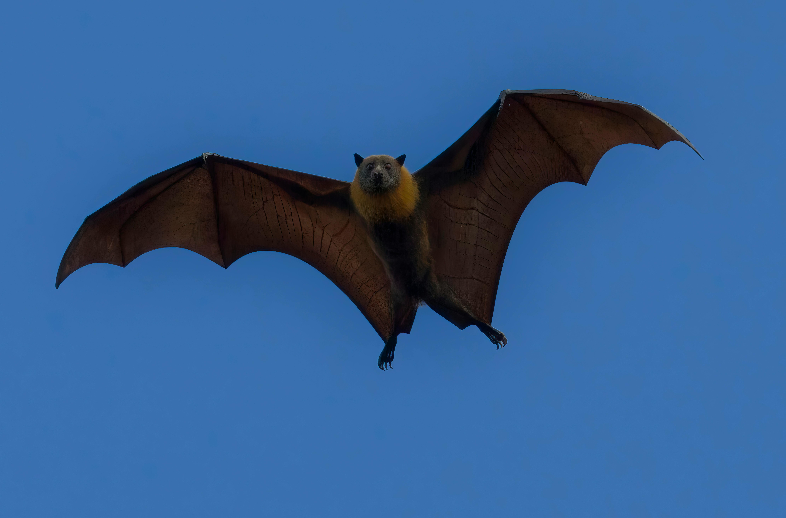
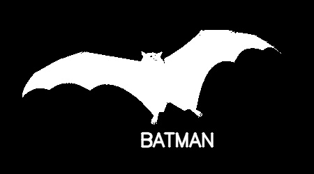

# Session 27

## 1. Make the Batman Logo

**Task**: Create the iconic Batman logo.

| INPUT | OUTPUT| 
|:----------:|:----------:|
||| 

## 2. Make a TV Noise 

**Task**: Generating an animation that mimics the visual noise seen on a TV.


 


## 3. Make a Landscape with Snowfall 

**Task**: Create a digital landscape featuring snowfall.


 


## 4. Write a Color Detector Using Webcam

**Task**: Develop a color detector program that utilizes the webcam to detect colors (Gray, White,Black).


## How to Run the Code
1. Clone the repository:
   ```sh
   git clone https://github.com/nakhani/Image-Processing/tree/714785bed50b25b2b4ae1e323dbcdbce5624f94a/session27
   ```

2. Navigate to the directory:
   ```sh
   cd session27
   ```

3. Install the required packages:
   ```sh
   pip install -r requirements.txt
   ```

4. Run the assignments:
   ```sh
   python batman.py  # For generating a batman's logo
   python detector.py  # For detecting colors in webcam
   python snow.py  # For generating snowing landscape GIF
   python noise.py  # For generating the noisy TV GIF
   ```

## Technologies Used
- Python 3
- OpenCV
